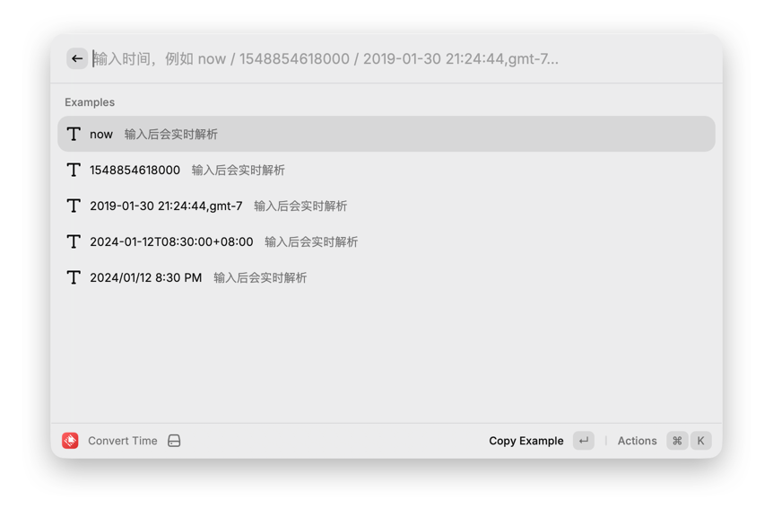
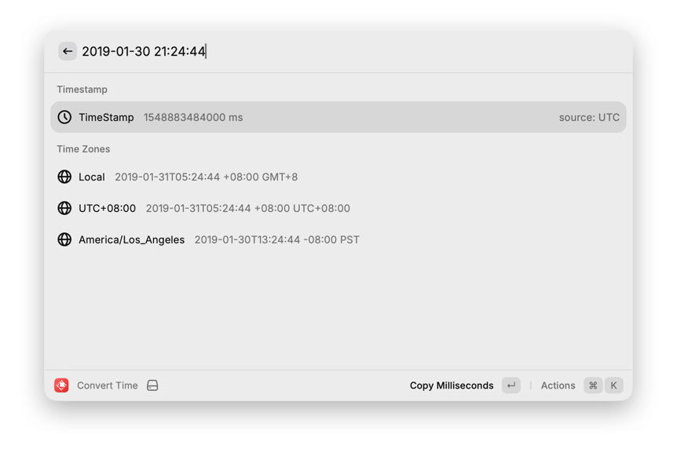

# Time Convert (Raycast)

一个将 `time-format-alfred`（Go）迁移到 Raycast 的 TypeScript 扩展。

它的目标是：输入任意常见时间文本，快速解析成时间戳，并按多个时区输出格式化结果。

## 功能概览

- 多格式时间解析（保留原 Alfred 版本的“状态机分流 + 多模式匹配”思路）
- 支持时间戳输入：秒 / 毫秒 / 微秒 / 纳秒
- 支持相对时间：`now`、`1 minutes ago`、`2 hours ago`、`1 day ago`
- 支持中英文常见日期格式
- 支持在输入末尾指定“源时区”
- 输出：
  - `TimeStamp`（毫秒）
  - 多时区时间字符串：`YYYY-MM-DDTHH:mm:ss ±HH:mm ZONE`

## 常见输入示例

- `now`
- `1548854618`
- `1548854618000`
- `1548854618000000`
- `1548854618000000000`
- `2019-01-30 21:24:44`
- `2019-01-30T21:24:44+08:00`
- `2024/01/12 8:30 PM`
- `20060102150405`
- `20060102`
- `2006年01月02日 15:04`
- `12 Feb 2006, 19:17`
- `May 8, 2009 5:57:51 PM`
- `1 minutes ago`

## 时区规则

1. 如果输入里自带时区（如 `+08:00` / `UTC` / `GMT` / IANA），按输入时区解析。
2. 如果输入末尾使用逗号追加时区（如 `2019-01-30 21:24:44,gmt-7`），按该时区解析。
3. 否则使用扩展配置里的 `Default Input Zone`。
4. 解析成功后按 `Output Zones` + 本地时区输出结果。

## 配置项

在 Raycast 命令 `Convert Time` 的 Preferences 中：

- `Default Input Zone`
  - 用于无时区输入的默认来源时区。
  - 示例：`Local`、`UTC`、`GMT-7`、`Asia/Shanghai`
- `Output Zones`
  - 逗号分隔的输出时区列表。
  - 示例：`UTC,America/Los_Angeles,Asia/Shanghai`

## 使用方式

1. 在 Raycast 中运行 `Convert Time`。
2. 输入任意时间文本。
3. 通过 `↵` 进入 Action，复制时间戳或某个时区的格式化结果。

## Screenshots





## 本地开发

```bash
npm install
npm run dev
```

## 说明

- 当前实现优先覆盖 Alfred 版本的高频输入格式。
- 如需补齐更冷门格式（例如某些 RFC 变体），可以继续扩展 `src/lib/parser.ts` 的匹配分支。
