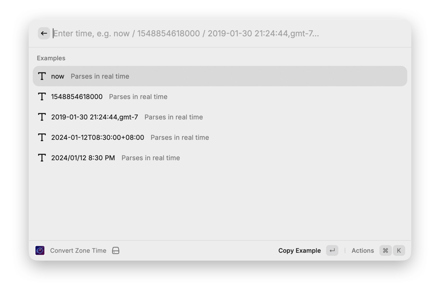

# Time Convert (Raycast)

A TypeScript Raycast extension migrated from `time-format-alfred` (Go).

Its goal is simple: enter common time text, parse it quickly into a timestamp, and output formatted results across multiple time zones.

## Feature Overview

- Multi-format time parsing (keeps the original Alfred strategy: state-machine routing + multi-pattern matching)
- Supports timestamp input in seconds / milliseconds / microseconds / nanoseconds
- Supports relative time: `now`, `1 minutes ago`, `2 hours ago`, `1 day ago`
- Supports common Chinese and English date formats
- Supports specifying the source time zone at the end of the input
- Output:
  - `TimeStamp` (milliseconds)
  - Multi-zone time string: `YYYY-MM-DDTHH:mm:ss ±HH:mm ZONE`

## Common Input Examples

- `now`
- `1548854618`
- `1548854618000`
- `1548854618000000`
- `1548854618000000000`
- `2019-01-30 21:24:44`
- `2019-01-30T21:24:44+08:00`
- `2024/01/12 8:30 PM`
- `20060102150405`
- `20060102`
- `2006-01-02 15:04`
- `12 Feb 2006, 19:17`
- `May 8, 2009 5:57:51 PM`
- `1 minutes ago`

## Time Zone Rules

1. If the input includes a time zone (such as `+08:00`, `UTC`, `GMT`, or an IANA zone), it is parsed with that zone.
2. If a zone is appended after a comma (for example, `2019-01-30 21:24:44,gmt-7`), that appended zone is used.
3. Otherwise, the extension uses `Default Input Zone` from preferences.
4. After parsing succeeds, results are rendered using `Output Zones` plus your local time zone.

## Preferences

In the `Convert Time` command preferences:

- `Default Input Zone`
  - Default source time zone for inputs without an explicit zone.
  - Examples: `Local`, `UTC`, `GMT-7`, `Asia/Shanghai`
- `Output Zones`
  - Comma-separated list of output time zones.
  - Example: `UTC,America/Los_Angeles,Asia/Shanghai`

## Usage

1. Run `Convert Time` in Raycast.
2. Enter any time text.
3. Press `↵` to open Actions, then copy the timestamp or a formatted value in a specific zone.

## Screenshots




## Local Development

```bash
npm install
npm run dev
```

## Notes

- The current implementation prioritizes the most common formats from the Alfred version.
- If you need additional edge formats (for example, specific RFC variants), extend the matching branches in `src/lib/parser.ts`.
